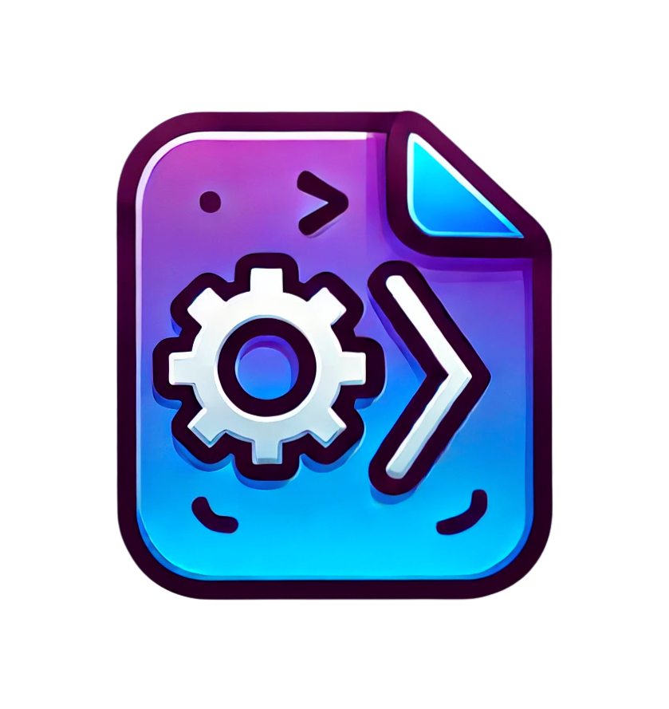

# 🛠️ Ultimate Code Generator

<p align="center">
  
</p>

**Ultimate Code Generator** é um aplicativo HTML simples e eficiente que permite gerar arquivos de código em diversas linguagens de programação diretamente no navegador.


---

## 🚀 Como Usar
1. Abra o arquivo **UCG-UltimateCodeGenerator.html** no navegador.
2. Digite ou cole seu código no campo de texto.
3. Escolha o formato desejado:
   - HTML, CSS, JS, Python, SQL, Markdown, etc.
4. Clique em **"Generate File"**.
5. O arquivo será baixado automaticamente no formato escolhido.

---

## 🌟 Recursos
- Suporte a múltiplos formatos de código: **HTML, CSS, JS, Python, SQL, XML, Markdown** e outros.
- Interface moderna e intuitiva.
- Rápido e funcional: Nenhuma instalação ou backend é necessário.

---

## 🔒 Prova de Autoria
O projeto é autenticado com o seguinte **hash SHA-256**:

```
c93d376d4e156365111432aea132077e1ac04fb334f1f9e0bfeb985e8e79cfcf
```

---

## 📫 Contato
- **Autor**: JCarmin  
- **GitHub**: [jadercarminatti](https://github.com/jadercarminatti)  
```
